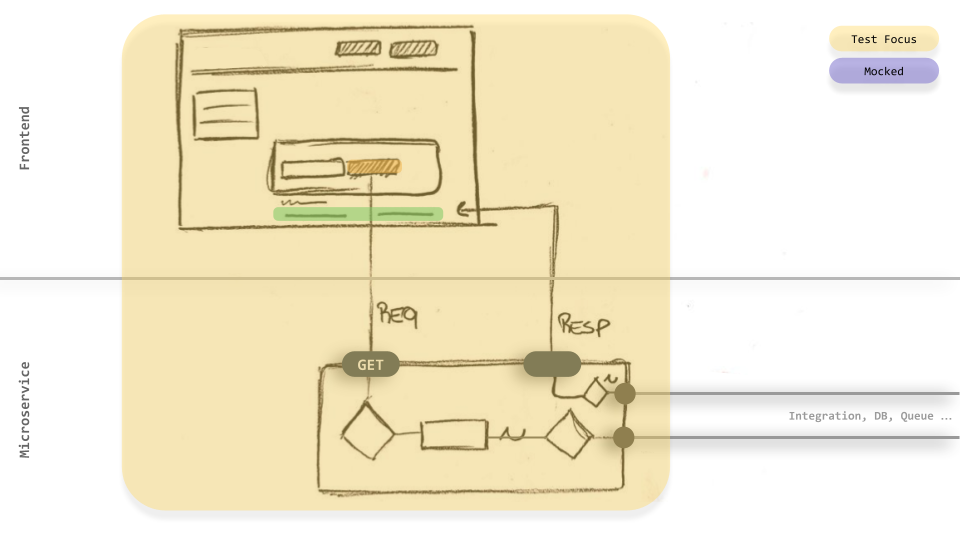
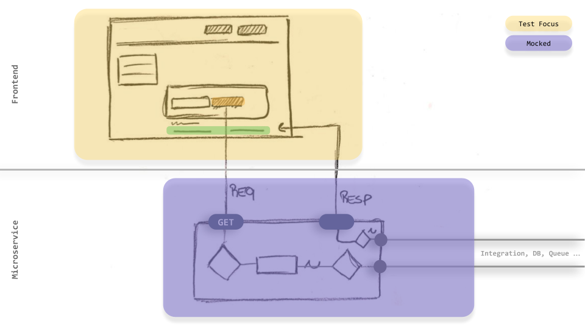

# cypress-base
> Plug and play structure with Cypress for E2E and integration tests.

## Validated on Github Actions :
[](https://github.com/victorcampos-mbciet/cypress-base/actions/workflows/cypress-test.yml)

## Sample application :
https://pokeapi.co/

## Structure :
```
.
├── cypress
│   ├── fixtures
│   │   └── api
│   │       └── pokemon
│   │           └── GET
│   │               ├── 200
│   │               │   └── response.json
│   │               └── 500
│   │                   └── response.json
│   ├── integration
│   │   ├── 1.real
│   │   │   └── 1.Home
│   │   │       └── a.success.spec.js
│   │   └── 2.mocked
│   │       └── 1.Home
│   │           ├── a.success.spec.js
│   │           └── b.error.spec.js
│   ├── plugins
│   │   └── index.js
│   ├── results
│   │   └── json
│   │       ├── mochawesome_001.json
│   │       ├── mochawesome_002.json
│   │       ├── mochawesome_003.json
│   │       ├── mochawesome_004.json
│   │       ├── mochawesome_005.json
│   │       ├── mochawesome_006.json
│   │       ├── mochawesome_007.json
│   │       └── mochawesome.json
│   └── support
│       ├── commands
│       │   ├── custom
│       │   │   └── assert.js
│       │   └── mocks
│       │       └── api-pokemon.js
│       ├── commands.js
│       ├── helpers
│       │   └── selectors.js
│       ├── index.js
│       └── pages
│           └── homePage.js
├── cypress.json
├── index.json
├── package.json
├── package-lock.json
├── public
├── README.md
└── reporter-config.json
```

## Install :
```
npm i
```

## E2E tests :
- Runnig with headfull mode :
```
npm run cy:e2e:open
```
- Runnig with headless mode :
```
npm run cy:e2e:run
```

### E2E concept :
> Frontend + Backend :  


> **E2E test** : All environment up : 


## Integration tests :

- Runnig with headfull mode :
```
npm run cy:integration:open
```
- Runnig with headless mode :
```
npm run cy:integration:run
```
### Integration concept :
> Frontend + Backend :  


>  **Integration test:** Frontend → `FULL UP` **and** Backend → `Mocked` : 
>  [In this project](https://github.com/victorcampos-mbciet/cypress-base/blob/master/cypress/support/commands/mocks/api-pokemon.js) we use `cy.intercept` to mock :
```JavaScript
Cypress.Commands.add('mock_api_pokemon', (httpMethod, statusCode, param) => {
    cy.intercept(httpMethod, `${Cypress.env('URL_API_POKEMON').pokemon}/${param}`, {
        statusCode: statusCode,
        fixture: `api/pokemon/${httpMethod}/${statusCode}/response.json`
      }).as(`mock_api_pokemon_${httpMethod}_response`);
});
```


## Base url :
> The `baseUrl` is configured in the `package.json`:
```
"cy:e2e:open": "cypress open --browser chrome --config baseUrl=https://pokeapi.co/"
```

## Running🏃🏃: 


## Report 📝 :
> After each execution in `Github Actions` a report is available in [ this branch](https://github.com/victorcampos-mbciet/cypress-base/tree/gh-pages). Make the Download and open the `index.html`.

> In the future the ideia is use `https://pages.github.com/`.


