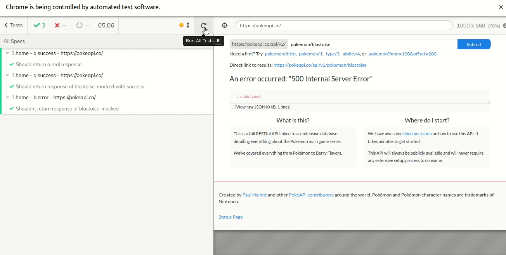

# cypress-base
> Plug and play structure with Cypress for E2E and integration tests.

## Validated on Github Actions :
[](https://github.com/victorcampos-mbciet/cypress-base/actions/workflows/cypress-test.yml)

## Sample application :
https://pokeapi.co/

## Structure :
```
.
├── cypress
│   ├── fixtures
│   │   └── api
│   │       └── pokemon
│   │           ├── 200
│   │           │   └── response.json
│   │           └── 500
│   │               └── response.json
│   ├── integration
│   │   ├── 1.real
│   │   │   └── 1.Home
│   │   │       └── a.success.spec.js
│   │   └── 2.mocked
│   │       └── 1.Home
│   │           ├── a.success.spec.js
│   │           └── b.error.spec.js
│   ├── plugins
│   │   └── index.js
│   └── support
│       ├── commands
│       │   ├── custom
│       │   │   └── assert.js
│       │   └── mocks
│       │       └── api-pokemon.js
│       ├── commands.js
│       ├── helpers
│       │   └── selectors.js
│       ├── index.js
│       └── pages
│           └── homePage.js
├── cypress.json
├── package.json
├── package-lock.json
└── README.md
```

## Install :
```
npm i
```

## E2E tests :
- Runnig with headfull mode :
```
npm run cy:e2e:open
```
- Runnig with headless mode :
```
npm run cy:e2e:run
```
<details>
  <summary>What concept did i take into account on e2e test ?</summary>
  > TODO
</details> 

## Integration tests :

- Runnig with headfull mode :
```
npm run cy:integration:open
```
- Runnig with headless mode :
```
npm run cy:integration:run
```

<details>
  <summary>What concept did i take into account on integration ?</summary>
  > TODO
</details> 

## Base url :
> The `baseUrl` is configured in the ´package.json´:
```
"cy:e2e:open": "cypress open --browser chrome --config baseUrl=https://pokeapi.co/"
```

## Running🏃🏃: 


## TODO
- [] Add report
- [] Add concept draw
